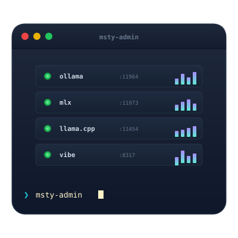

<div align="center">



# Msty Admin MCP — v6.0.0

</div>

Comprehensive MCP server for administering **Msty Studio Desktop 2.9+** with **55 tools** across 8 phases: real Studio path/DB detection, entity inventory (Context Studio, Knowledge Stacks, Agent Mode, Turnstiles, …), insights analytics, Nexus bridge, Bloom evaluation, and multi-backend local inference.

**Requirements**: Python 3.10+, MCP SDK v1.0.0+, psutil 5.9.0+

**Latest**: v6.0.0 (2026-08-01) — Studio 2.9 path/DB fix, Phase 7 inventory, Phase 8 Nexus, insights-backed analytics

> **New to Bloom?** Jump to the [Bloom Behavioral Evaluation](#bloom-behavioral-evaluation) section or read the [full Bloom guide](docs/BLOOM_GUIDE.md).

---

## Installation

### Quick Start
```bash
pip install msty-admin-mcp
msty-admin-mcp  # Runs on stdio (default MCP transport)
```

### With HTTP Transport
```bash
pip install msty-admin-mcp[http]
msty-admin-mcp --transport streamable-http  # Runs on http://localhost:8000
```

### From Source
```bash
git clone https://github.com/M-Pineapple/msty-admin-mcp
cd msty-admin-mcp
pip install -e .
pytest tests/ -v
```

---

## Configuration

Environment variables (all optional, sensible defaults):

```bash
# Msty installation host
MSTY_HOST=127.0.0.1

# Service backend ports (also read from Studio Gifnoc.nosj when present)
MSTY_AI_PORT=11964           # Local AI (Ollama)
MSTY_MLX_PORT=11973          # MLX service
MSTY_LLAMACPP_PORT=11454     # LLaMA.cpp service
MSTY_VIBE_PORT=8317          # Vibe CLI Proxy
MSTY_NEXUS_PORT=11434        # Msty Nexus OpenAI-compatible gateway

# Service timeout
MSTY_TIMEOUT=10              # Seconds

# Bloom integration (required for Phase 6 tools)
ANTHROPIC_API_KEY=sk-...     # Required for Bloom judge model
```

---

## Architecture

### Studio 2.9+ data layout

Msty Studio no longer uses a top-level `msty.db`. The workspace SQLite lives under the Chromium File System API path, for example:

```
~/Library/Application Support/MstyStudio/
├── Gifnoc.nosj                          # service config (ports / model paths)
├── models/  models-mlx/
└── File System/000/t/00/00000000        # Drizzle SQLite workspace DB
```

The MCP auto-detects `/Applications/MstyStudio.app`, reads the bundle version, resolves the SQLite blob, and opens it **read-only**.

### Service discovery

```
Msty Studio Desktop
├── Local AI (Ollama) → port 11964
├── MLX → port 11973
├── LLaMA.cpp → port 11454
├── Vibe CLI Proxy → port 8317
└── Msty Nexus (optional) → port 11434

         ↓

MCP Server (stdio / HTTP)
├── Phase 1: Foundational (6)
├── Phase 2: Configuration (4)
├── Phase 3: Service Integration (11)
├── Phase 4: Intelligence (5)
├── Phase 5: Calibration (4)
├── Phase 6: Bloom Evaluation (6)
├── Phase 7: Studio Inventory (15)
└── Phase 8: Nexus Bridge (4)
```

---

## Tools Summary (55 Total)

### Phase 1: Foundational (6)
- `detect_msty_installation` — app, version, DB path, ports
- `read_msty_database` — `stats` / `tables` / read-only SQL
- `list_configured_tools` — Toolbox MCP tools
- `get_model_providers` — services + Studio providers (keys redacted)
- `analyse_msty_health` — install + DB + services
- `get_server_status` — MCP status

### Phase 2: Configuration (4)
- `export_tool_config` — export a tool by name/id
- `sync_claude_preferences` — Claude ↔ Msty delta report
- `generate_persona` — persona JSON for Persona Studio
- `import_tool_config` — validate import (live DB writes refused by default)

### Phase 3: Service Integration (11)
- `get_service_status`, `list_available_models`, `query_local_ai_service`
- `chat_with_local_model`, `recommend_model`
- `list_mlx_models`, `chat_with_mlx_model`
- `list_llamacpp_models`, `chat_with_llamacpp_model`
- `get_vibe_proxy_status`, `query_vibe_proxy`

### Phase 4: Intelligence (5)
- `get_model_performance_metrics` — from Studio `insightsLanguageModelUsage`
- `analyse_conversation_patterns`
- `compare_model_responses`
- `optimise_knowledge_stacks` — live Next Gen / draft / compose status
- `suggest_persona_improvements`

### Phase 5: Calibration (4)
- `run_calibration_test`, `evaluate_response_quality`
- `identify_handoff_triggers`, `get_calibration_history`

### Phase 6: Bloom Evaluation (6)
- `bloom_evaluate_model`, `bloom_check_handoff`, `bloom_get_history`
- `bloom_list_behaviors`, `bloom_get_thresholds`, `bloom_validate_model`

### Phase 7: Studio 2.9 Inventory (15)
- `list_studio_catalogue`, `list_workspaces`, `list_personas`
- `list_shadow_personas`, `list_crews`, `list_knowledge_stacks`
- `list_turnstiles`, `list_skills`, `list_live_contexts`, `list_prompts`
- `list_context_studio`, `list_agent_plans`
- `get_studio_entity`, `get_schema_migrations`, `export_workflow_pack`

### Phase 8: Nexus Bridge (4)
- `detect_nexus`, `list_nexus_models`, `query_nexus`, `get_insights_usage`

---

## Bloom Behavioral Evaluation

Phase 6 introduces behavioral evaluation powered by [Anthropic's Bloom framework](https://www.anthropic.com/research/bloom). Rather than testing what a model knows, Bloom tests how it behaves — detecting failure modes like sycophancy, hallucination, and overconfidence that standard benchmarks miss.

See the **[Bloom Knowledge Base Guide](docs/BLOOM_GUIDE.md)**.

---

## Testing

```bash
pytest tests/ -v
```

v6 ships unit tests for path resolution, read-only SQL guards, redaction, inventory/analytics, and MCP tool JSON contracts. Live smoke on Studio 2.9.2 was verified during release.

---

## FAQ

### Q: Why did detection fail on older MCP versions?
**A**: v5 looked for `~/Library/Application Support/Msty/msty.db`. Studio 2.x stores data under `MstyStudio` and the Chromium File System SQLite path. v6 fixes this.

### Q: Can I use this with Msty &lt; 2.4.0?
**A**: No. v6 targets Studio 2.9+ (works on 2.4+ layouts when the File System DB is present). Use v4.x for older process-based detection.

### Q: Does this write to the Studio database?
**A**: Inventory and analytics are read-only. `import_tool_config` refuses live writes by default because Studio may hold locks on the File System DB. Prefer Toolbox JSON import for writes.

### Q: What's the Nexus integration?
**A**: [Msty Nexus](https://msty.ai/nexus/) is the local runtime/gateway. Phase 8 detects it and lists models via its OpenAI-compatible endpoint (`MSTY_NEXUS_PORT`).

---

## License

MIT License — See LICENSE file

## Contributing

Contributions welcome! Please open issues or PRs on GitHub.

## 💖 Support This Project

If this project has helped enhance your development workflow or saved you time, please support :

<a href="https://www.buymeacoffee.com/mpineapple" target="_blank"></a>

Your support helps me:

* Maintain and improve this project with new features
* Keep the project open-source and free for everyone
* Dedicate more time to addressing user requests and bug fixes
* Explore new terminal integrations and command intelligence

Thank you for considering supporting my work! 🙏

## Support

For issues, questions, or feature requests, visit: https://github.com/M-Pineapple/msty-admin-mcp
[](https://mseep.ai/app/m-pineapple-msty-admin-mcp)
