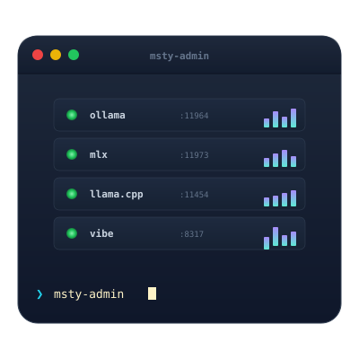

<div align="center">



# Msty Admin MCP — v6.1.0

</div>

Comprehensive MCP server for administering **Msty Studio Desktop 2.9+** with **56 tools** across 9 phases: real Studio path/DB detection, entity inventory (Context Studio, Knowledge Stacks, Agent Mode, Turnstiles, …), insights analytics, Nexus bridge, Bloom evaluation, multi-backend local inference, and a handoff from a local model to the Cursor agent on this Mac.

**Requirements**: Python 3.10+, MCP SDK v1.0.0+, psutil 5.9.0+

**Latest**: v6.1.0 (2026-10-04) — local models can hand a hard question to the Cursor agent on this Mac and see the answer in the same Msty chat.

> **New to Bloom?** Jump to the [Bloom Behavioral Evaluation](#bloom-behavioral-evaluation) section or read the [full Bloom guide](docs/BLOOM_GUIDE.md).

---

## Installation

### Quick Start
```bash
pip install msty-admin-mcp
msty-admin-mcp  # Runs on stdio (default MCP transport)
```

### With HTTP Transport
```bash
pip install msty-admin-mcp[http]
msty-admin-mcp --transport streamable-http  # Runs on http://localhost:8000
```

### From Source
```bash
git clone https://github.com/M-Pineapple/msty-admin-mcp
cd msty-admin-mcp
pip install -e .
pytest tests/ -v
```

---

## Configuration

Environment variables (all optional, sensible defaults):

```bash
# Msty installation host
MSTY_HOST=127.0.0.1

# Service backend ports (also read from Studio Gifnoc.nosj when present)
MSTY_AI_PORT=11964           # Local AI (Ollama)
MSTY_MLX_PORT=11973          # MLX service
MSTY_LLAMACPP_PORT=11454     # LLaMA.cpp service
MSTY_VIBE_PORT=8317          # Vibe CLI Proxy
MSTY_NEXUS_PORT=11434        # Msty Nexus OpenAI-compatible gateway

# Service timeout
MSTY_TIMEOUT=10              # Seconds

# Bloom integration (required for Phase 6 tools)
ANTHROPIC_API_KEY=sk-...     # Required for Bloom judge model
```

---

## Architecture

### Studio 2.9+ data layout

Msty Studio no longer uses a top-level `msty.db`. The workspace SQLite lives under the Chromium File System API path, for example:

```
~/Library/Application Support/MstyStudio/
├── Gifnoc.nosj                          # service config (ports / model paths)
├── models/  models-mlx/
└── File System/000/t/00/00000000        # Drizzle SQLite workspace DB
```

The MCP auto-detects `/Applications/MstyStudio.app`, reads the bundle version, resolves the SQLite blob, and opens it **read-only**.

### Service discovery

```
Msty Studio Desktop
├── Local AI (Ollama) → port 11964
├── MLX → port 11973
├── LLaMA.cpp → port 11454
├── Vibe CLI Proxy → port 8317
└── Msty Nexus (optional) → port 11434

         ↓

MCP Server (stdio / HTTP)
├── Phase 1: Foundational (6)
├── Phase 2: Configuration (4)
├── Phase 3: Service Integration (11)
├── Phase 4: Intelligence (5)
├── Phase 5: Calibration (4)
├── Phase 6: Bloom Evaluation (6)
├── Phase 7: Studio Inventory (15)
├── Phase 8: Nexus Bridge (4)
└── Phase 9: Frontier handoff (1)
```

---

## Hybrid local model and Cursor agent

A local model does the ordinary work. When a question is past it, that model calls `ask_frontier`. The tool runs the Cursor agent on this machine and returns the answer in the same Msty chat. A follow-up resumes that Cursor chat.

Use a **separate one-tool server** for the local-model chat. The full admin server has 56 tools. A small model will call those other tools (GitHub, search, schema, and so on) instead of waiting for the answer.

### Fresh install

1. Install this package and the Cursor agent CLI (`cursor-agent`). It must be on the PATH seen by Msty, or at `~/.local/bin/cursor-agent`. Login and API keys: [Cursor CLI authentication](https://cursor.com/docs/cli/reference/authentication).
2. Create a **user** API key in Cursor Dashboard → API Keys. An admin key does not work. Do not commit the key and do not put it in this repo.
3. In Msty, add a toolbox server named Frontier. From a source checkout:

```json
{
  "command": "/absolute/path/to/venv/bin/python",
  "args": ["-m", "src.frontier_main"],
  "env": {
    "PYTHONPATH": "/absolute/path/to/msty-admin-mcp",
    "CURSOR_API_KEY": "your-user-api-key"
  }
}
```

After `pip install`, the console script `msty-frontier` is the same one-tool server. You can set `command` to that script and omit `PYTHONPATH`.

4. Create a toolset that contains **only** this Frontier server. Do not put GitHub, Brave, Trello, or the full admin server in that toolset.
5. On the local-model chat, select that toolset in the composer (the active-toolset control). The toolset stored on the chat is not what is sent if the composer still has another toolset selected.
6. Quit Msty and open it again after any toolbox or environment change.
7. Ask a question the local model cannot already answer. Success is one `ask_frontier` card, then the Cursor reply under it. A normal paragraph with no card means the model answered by itself and Cursor was not asked.

### Optional project folder

By default the Cursor agent reads an empty folder under `~/.msty-admin/frontier-workspace`. It cannot see your repositories. To let it read one project, set:

```json
"MSTY_FRONTIER_WORKSPACE": "/absolute/path/to/that/project"
```

Ask mode does not send mail, move or delete files, or use trading tools. It can read that folder.

### Update from v6.0.0

The admin server is unchanged for Studio inventory and the other 55 tools. Add the Frontier server and the one-server toolset as above. Do not point the local-model chat at the full `msty-admin-mcp` command.

### Caveats

- The local model must emit a real tool call. Some small models never do, and then no amount of "please call the tool" in the user message will reach Cursor. A model that can call tools will. It may rewrite your question into a search command. That is still a successful handoff if the card is `ask_frontier` and the text under it came from Cursor.
- `cursor-agent status` can say "not logged in" while ask mode still works with `CURSOR_API_KEY`. The frontier process passes that variable as `--api-key`. A browser `cursor-agent login` in your terminal is not always visible to the process Msty starts.
- Several `ask_frontier` calls in one reply share the first Cursor answer. They do not each start a new chat.
- The last Cursor chat id is stored in `~/.msty-admin/frontier-session.json` (mode `0600`). Delete that file to start a fresh Cursor chat.
- `identify_handoff_triggers` only scores past speed and latency. It does not send the question.

---

## Tools Summary (56 Total)

### Phase 1: Foundational (6)
- `detect_msty_installation` — app, version, DB path, ports
- `read_msty_database` — `stats` / `tables` / read-only SQL
- `list_configured_tools` — Toolbox MCP tools
- `get_model_providers` — services + Studio providers (keys redacted)
- `analyse_msty_health` — install + DB + services
- `get_server_status` — MCP status

### Phase 2: Configuration (4)
- `export_tool_config` — export a tool by name/id
- `sync_claude_preferences` — Claude ↔ Msty delta report
- `generate_persona` — persona JSON for Persona Studio
- `import_tool_config` — validate import (live DB writes refused by default)

### Phase 3: Service Integration (11)
- `get_service_status`, `list_available_models`, `query_local_ai_service`
- `chat_with_local_model`, `recommend_model`
- `list_mlx_models`, `chat_with_mlx_model`
- `list_llamacpp_models`, `chat_with_llamacpp_model`
- `get_vibe_proxy_status`, `query_vibe_proxy`

### Phase 4: Intelligence (5)
- `get_model_performance_metrics` — from Studio `insightsLanguageModelUsage`
- `analyse_conversation_patterns`
- `compare_model_responses`
- `optimise_knowledge_stacks` — live Next Gen / draft / compose status
- `suggest_persona_improvements`

### Phase 5: Calibration (4)
- `run_calibration_test`, `evaluate_response_quality`
- `identify_handoff_triggers`, `get_calibration_history`

### Phase 6: Bloom Evaluation (6)
- `bloom_evaluate_model`, `bloom_check_handoff`, `bloom_get_history`
- `bloom_list_behaviors`, `bloom_get_thresholds`, `bloom_validate_model`

### Phase 7: Studio 2.9 Inventory (15)
- `list_studio_catalogue`, `list_workspaces`, `list_personas`
- `list_shadow_personas`, `list_crews`, `list_knowledge_stacks`
- `list_turnstiles`, `list_skills`, `list_live_contexts`, `list_prompts`
- `list_context_studio`, `list_agent_plans`
- `get_studio_entity`, `get_schema_migrations`, `export_workflow_pack`

### Phase 8: Nexus Bridge (4)
- `detect_nexus`, `list_nexus_models`, `query_nexus`, `get_insights_usage`

### Phase 9: Frontier handoff (1)
- `ask_frontier` — hand one question to the Cursor agent on this machine and return the answer in the Msty chat. Use the one-tool server (`msty-frontier` or `python -m src.frontier_main`) for a local-model chat. See [Hybrid local model and Cursor agent](#hybrid-local-model-and-cursor-agent).

---

## Bloom Behavioral Evaluation

Phase 6 introduces behavioral evaluation powered by [Anthropic's Bloom framework](https://www.anthropic.com/research/bloom). Rather than testing what a model knows, Bloom tests how it behaves — detecting failure modes like sycophancy, hallucination, and overconfidence that standard benchmarks miss.

See the **[Bloom Knowledge Base Guide](docs/BLOOM_GUIDE.md)**.

---

## Testing

```bash
pytest tests/ -v
```

v6 ships unit tests for path resolution, read-only SQL guards, redaction, inventory/analytics, and MCP tool JSON contracts. Live smoke on Studio 2.9.2 was verified during release.

---

## FAQ

### Q: How does a local model ask Cursor?
**A**: Run the one-tool server, put only that server in the chat's toolset, and set `CURSOR_API_KEY` on that server. Steps and caveats are in [Hybrid local model and Cursor agent](#hybrid-local-model-and-cursor-agent). The key stays in Msty's toolbox environment. It does not belong in this repository.

### Q: Why did detection fail on older MCP versions?
**A**: v5 looked for `~/Library/Application Support/Msty/msty.db`. Studio 2.x stores data under `MstyStudio` and the Chromium File System SQLite path. v6 fixes this.

### Q: Can I use this with Msty &lt; 2.4.0?
**A**: No. v6 targets Studio 2.9+ (works on 2.4+ layouts when the File System DB is present). Use v4.x for older process-based detection.

### Q: Does this write to the Studio database?
**A**: Inventory and analytics are read-only. `import_tool_config` refuses live writes by default because Studio may hold locks on the File System DB. Prefer Toolbox JSON import for writes.

### Q: What's the Nexus integration?
**A**: [Msty Nexus](https://msty.ai/nexus/) is the local runtime/gateway. Phase 8 detects it and lists models via its OpenAI-compatible endpoint (`MSTY_NEXUS_PORT`).

---

## License

MIT License — See LICENSE file

## Contributing

Contributions welcome! Please open issues or PRs on GitHub.

## 💖 Support This Project

If this project has helped enhance your development workflow or saved you time, please support :

<a href="https://www.buymeacoffee.com/mpineapple" target="_blank"></a>

Your support helps me:

* Maintain and improve this project with new features
* Keep the project open-source and free for everyone
* Dedicate more time to addressing user requests and bug fixes
* Explore new terminal integrations and command intelligence

Thank you for considering supporting my work! 🙏

## Support

For issues, questions, or feature requests, visit: https://github.com/M-Pineapple/msty-admin-mcp
[](https://mseep.ai/app/m-pineapple-msty-admin-mcp)
